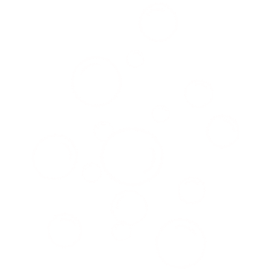

*This text is italic.*  
**This text is bold.**  
~~This text is strikethrough~~
1. Item 1
2. Item 2
3. Item 3

- Tiem 1
- Tiem 2
- Tiem 3
- Tiem 4
    * item 5
    1. item6
    2. item7
    * item 8
   
  

[link]: <www.youtube.com>
Wanna see something [funny][link]?

# Bali

 ```python
    print("Hello, world!")
        for i in range(10):
        print(i)
```
```cpp
    #include <iostream>
    using namespace std;
    int main(){
        cout <<"Hello World" << endl;
    }
```